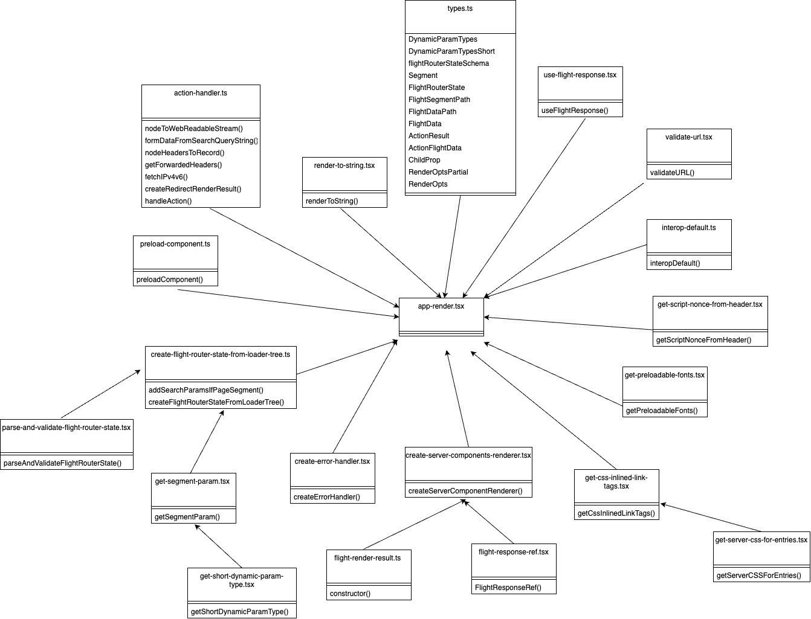

Collaborators: Peijie Zheng, Axel Zhao, Belle Ge, Jun Ahn

# Context and Background
## Next.js
GitHub repo: https://github.com/vercel/next.js

Official Documentation: https://nextjs.org/

## What is Next.js and what does it do?
Next.js is a popular open-source React-based framework that simplifies the creation of full-stack applications. It allows developers to build high-performance web applications with ease by providing features such as server-side rendering, automatic code splitting, static file serving, and optimized prefetching of resources. From a user perspective, it enables faster page loading, smoother routing requests, and a seamless user experience when interacting with web applications built with Next.js.

## Creators and Maintainers
Next.js is created and currently maintained by Vercel, a popular cloud platform company for web application deployment. The authors are Tim Neutkens, Naoyuki Kanezawa, Guillermo Rauch, Arunoda Susiripala, Tony Kovanen, and Dan Zajdband. The framework is developed and maintained by a team of developers who are currently working for Vercel.

Changes and contributions to the codebase are made via pull requests. They need to pass the repository's automated tests, then the requests will be reviewed/approved by the code owners/reviewers (can be found in any existing pull requests).


# Development View

## Components Explanation
* action-handler.ts:
    * Handles server-side action and output responses based on the action type and outcome.

* app-render.tsx
    * Render the application.

* create-error-handler.tsx
    * Handle errors during rendering the app.

* create-flight-router-state-from-loader-tree.ts
    * Provide functions to manipulatie components, adding search parameters, and constructing flight router states.

* create-server-components-renderer.tsx
    * Create a component that renders the Flight stream.

* flight-render-result.ts
    * The result of rendering a flight response in the application.

* flight-response-ref.tsx
    * Define a reference to a flight response in a component.

* get-css-inlined-link-tags.tsx
    * Get external stylesheet link hrefs based on server CSS manifest.

* get-preloadable-fonts.tsx
    * Get hrefs for fonts to preload.

* get-script-nonce-from-header.tsx
    * Extracts nonce value from a header string, makes sure it is free from invalid characters.

* get-segment-param.tsx
    * Analyzes dynamic route segment to the type of parameter it represents.

* get-server-css-for-entries.tsx
    * Retrieve server CSS modules.

* get-short-dynamic-param-type.tsx
    * Get the shorter dynamic parameter when transmitted to the browser.

* interop-default.ts
    * Interop between "export default" and "module.exports".

* parse-and-validate-flight-router-state.tsx
    * Parse and validate the flight router state.

* preload-component.ts
    * Preloading a component and its props.

* render-to-string.tsx
    * Render a React element to readable string.

* types.ts
    * Defines types and schemas inside flight router and application rendering process.

* use-flight-response.tsx
    * Render a flight response

* validate-url.tsx
    * Ensure the URL is valid.


## Visual Representation

<p align="center">Figure 1: UML Class Diagram</p>

The _Figure 1_ above is an overall summary of architectural elements in this project, it used UML class diagram to demonstrate each component's name, function/purpose, and relationship.

## Dependencies
Based on the textual explanations of components identified and UML class diagram _Figure 1_, the dependencies is defined as following:

* app-render.tsx is the main rendering component in this application with other components denpend on.

* create-server-components-renderer.tsx is another important component that has flight-render-result.ts and flight-response-ref.tsx to build on.

* create-flight-router-state-from-loader-tree.ts has parse-and-validate-flight-router-state.tsx, get-segment-param.tsx, and get-short-dynamic-param-type.tsx to build on

* get-css-inlined-link-tags.tsx has get-server-css-for-entries.tsx to build the application's css aspect

* types.ts contains all the attributes and served as utility file to provide data for the rest of the components.

## Source Code Structure
In the Next.js, action-handler.ts is used to manage various server-side actions, requests, and API. The create-error-handler.tsx file is used to handle errors. In terms of managing navigation and loading, it utilized create-error-handler.tsx, and rendered components in create-server-components-renderer.tsx.

Flight render results is stored in the flight-render-result.ts and its responses are managed by flight-response-ref.tsx. For CSS/style components, it is managed inside get-css-inlined-link-tags.tsx and get-preloadable-fonts.tsx. Files like get-segment-param.tsx, get-server-css-for-entries.tsx, and get-short-dynamic-param-type.tsx manages URL and parameter retrieval process. To build an interoperability with exports, it used Interop-default.ts.

Files like parse-and-validate-flight-router-state.tsx and validate-url.tsx ensures data validation. Preload-component.ts manages elements preloading, and render-to-string.tsx ensures data elements are converted to strings.

In addition to functional files above, Next.js used types.ts to hold all TypeScript types, attributes, and interfaces for the application.

## Testing and configuration
Next.js integrated automated testing is various ways, including e2e test, development test, production test, integration test, and unit test.

To set up and enable these testing, use ```pnpm new-test``` command to start a template related to the test type.
The ```pnpm``` test suites allows for specific tests:

```pnpm testheadless test/integration/production/ -t "should allow etag header support"```

Or entrie suites:

```pnpm testheadless test/integration/production/```

End-to-end (e2e) tests is a good place to start the test. It allows tests run in complete isolation from the repository. Hence, the system's temp folder creates local version of next, then linked to the application. A server is started on a random port, against which the tests will run. After the test run is done, that server is destroyed and all remaining files are deleted from the temp folder.

# Applied Perspective
## Chosen Perspective: __Evolution__

Evolution (modifiability) is an architectural quality that refers to the ability of a software system to maintain itself and accommodate changes, and the flexibility with which the system adapts to such changes. A widely-used software system often responds to evolving requirements, bug fixes, improvements, or other needs. This makes modifiability a crucial quality for any software system to easily adapt to changes. Thus, the ability to modify software efficiently and effectively reduces costs, minimizes the impact of changes, and ensures the long-term viability of the system needs to be assessed and documented.

## Relevant Concerns

1. Magnitude/Dimensions of Change

The magnitude/dimensions of change refer to the scale and scope of modifications or additions made to the framework. As a rapidly evolving web development framework, Next.js delivers its software system in an incremental process over time. From the evolution perspective, this means undergoing iterative changes and improvements driven by various factors in order to meet the needs of end users and the web environment. Next.js uses version release to describe the changes made to the system, with each release addressing changes made by internal decisions and various issues/feedback raised by the developer community on GitHub.

The magnitude of change varies from miscellaneous changes like bug fixes to core changes like code refactoring and feature addition. The most relevant dimensions of change for Next.js are functional and integration evolution. As mentioned, Next.js undergoes frequent changes, ranging from simple defect corrections to the addition of features. Any of these will prompt modifications to the system. Additionally, it needs to ensure compatibility with many other modern software systems. For example, since Next.js is built on top of the React library, it is designed to integrate React features, such as React components and hooks. This means Next.js needs to constantly modify the code that works with system integration to be compatible with new features introduced by the React library.


2. Changes Driven by External Factors

As a web framework, Changes made to Next.js can be subject to external factors, such as advancements in web technologies, changes in industry practices, and evolving user requirements. Part of what makes Next.js favorable in modern web development is its unique features and compatibility with other software systems that help achieve better developer and user experience. For instance, Next.js is built on top of React as mentioned above but also introduced features like serverless functions, API routes, and static site generation, which align with the trend of serverless architectures and the need for optimized performance in web applications. In the case where Next.js has to keep up with React or other technologies, and if industry trends and user requirements were to change, Next.js will likely modify its system to improve current features and add new features to meet those needs. Additionally, Next.js has an active community contribution ecosystem on GitHub where developers constantly look for bugs/improvements and provide feedback to improve the overall architecture/performance of the system. These factors can drive changes in Next.js to stay relevant and competitive in the rapidly evolving web development ecosystem.

## Applying the Perspective
__Characterize the Evolution Needs__
| Change | Type of change required | Magnitude of change required | Likelihood of change | Timescale of required changes |
| ----------- | ----------- | ----------- | ----------- | ----------- |
| Include other front-end frameworks/ libraries in Next.js app initialization | Integration | Somewhat large-scale and high risk. The create-next-app module responsible for app initialization needs to update its dependencies and bundling/configuring to ensure its compatibility in order to integrate with other frameworks/ libraries. Additionally, Next.js configures these options with their pre-defined templates, such as templates with or without Tailwind/Typescript. Including other frameworks/libraries means they need to create more templates. | Although this change offers flexibility and customization when creating a Next.js app, Next.js is not required to work with other frameworks/libraries. Integrating with them requires a lot of effort in terms of configuration and compatibility. It would also require ongoing maintenance to keep up to date with other systems' latest versions. Unless there is a strong user demand, it is unlikely that the Next.js team will implement this change. | If Next.js does decide to implement it, the timescale of this change is vague as it depends on the number of systems it wants to integrate with and the difficulty of adding them to its plugin system.  |
| Adapt and maintain compatibility with new React features | Integration | Depends on the scale of the new React features. For example, Next.js version 13.4 released the App Router (server routing) feature in addition to their traditional Page Router (client routing) to work with the latest introduced React Server Components feature. This is a large-scale change that took half a year and it went through multiple experimental stages (beta, alpha, stable) and testing. | It is very likely that Next.js continues this change to stay up-to-date with the latest React version as it is built on top of most React functionalities. In fact, the Next.js team is already working on their new Server Actions feature (currently in alpha) that allows data mutation on the server and performs asynchronous side effectswith zero client JavaScript to better utilize React Server Components. | Likely immediate, but the integration of new React features into Next.js may not happen instantaneously since it depends on the complexity and compatibility of this feature. |


__Consider the Evolution Tradeoffs__
| Change | Doing nothing | Designing but not implementing various options | Developing a fully flexible system from the outset |
| ----------- | ----------- | ----------- | ----------- |
| 1 | No impact on costs and does not induce risks to the current Next.js system. Not adding this does not affect the way Next.js is used as developers can manually import the frameworks/ libraries they want to use via a package manager. | Somewhat costly and risky since other solutions may also require moderate changes to the Next.js codebase. There are also limited options because Next.js uses a modular architecture, meaning the create-next-app is solely responsible for integrating with these frameworks/ libraries during app initialization. | Significant costs and risks as integrating with other frameworks/libraries require a developer team to regularly implement updates/changes and run maintenance. Next.js will also be at a higher risk of compatibility/bug issues which could cause the create-next-app module to not function correctly. |
| 2 | No costs but high risks. Next.js not keeping up-to-date with React's latest build can result in compatibility issues and poor user/developer experience.  | High costs and moderate risks. Other design options may or may not require more changes to the codebase. It may also affect its stability if the option is not fully compatible with both Next.js and React systems. | Significantly high costs trying to integrate with every new feature/improvement React makes and maintain it, but low risks because Next.js is tightly coupled with React. |


# Identify Styles & Patterns Used
## Architectural Style:

Based on the functionality and patterns observed, it is possible to infer that the code follows a combination of layered and modular architectural style.
Firstly, there are mainly four layers:
1. Presentation Layer: This layer is responsible for handling the presentation logic and rendering components to the user. It includes components, pages, and UI-related code. The presentation layer would typically be represented by React components in a Next.js application.
2. Application Layer: This layer contains the business logic and application-specific functionality. It includes modules responsible for handling routing, server-side rendering, and data fetching. The webpackBuild and webpackBuildWithWorker functions serve as the entry points for the webpack build process. They orchestrate the build by coordinating the execution of multiple compiler workers and handling the results.
3. Infrastructure Layer: This layer deals with the underlying infrastructure and frameworks used by Next.js. It includes modules for handling webpack configuration, compilation, and asset management. The BuildManifestPlugin is responsible for creating the build manifest.
4. Data Layer: The code interacts with the build configuration (config), plugin states, and other data structures specific to the build process. It passes the necessary data to the workers and receives the results to update the build context.

**Layer Connections: The layers are connected through function calls and module imports. For example, the ClientReferenceManifestPlugin class in the presentation layer imports modules from the application and infrastructure layers. The apply method of the plugin establishes connections with the compilation process and hooks into the webpack workflow.**

In terms of modular architectural style, there are some analysis of this architectural style:
1. Modularity: The code is organized into separate modules or components, each responsible for a specific functionality or feature. For example, there are modules for handling logging (Log), downloading dependencies (downloadWasmSwc), patching lockfiles (patchIncorrectLockfile), and loading SWC bindings (loadBindings).
2. Abstraction: The code defines various abstractions and interfaces to encapsulate and separate concerns. For example, there are functions like transform, minify, and parse that provide high-level interfaces for working with SWC transformations. The code also defines interfaces for working with custom TurboPack bindings and MDX compilation.
3. Loose Coupling: The modules or components are loosely coupled, meaning they have minimal dependencies on each other. This allows for easier maintenance, testing, and reusability of the code. The use of imports and exports in the system demonstrates the decoupling of functionality.
4. Configuration and Extension Points: The code utilizes environment variables (process.env) and allows for customization through custom TurboPack binary paths (__INTERNAL_CUSTOM_TURBOPACK_BINARY and __INTERNAL_CUSTOM_TURBOPACK_BINDINGS). These configuration options provide flexibility and extensibility to adapt the system to different environments or requirements.


## Software Design Patterns:

* Plugin Pattern: The Plugin pattern is used when we want to extend the functionality of a system dynamically by adding external modules or components. The problem is to make easy extension with the plugin without modifying its core implementation. The BuildManifestPlugin class implements the plugin pattern, which is commonly used in frameworks like webpack and Next.js. It hooks into the compilation process via webpack hooks, allowing the plugin to extend the build process and modify the output.

* Worker Pattern: The code leverages the worker pattern to execute separate compiler workers. The problem is to efficiently divide a large workload into smaller tasks that can be executed concurrently or in parallel, utilizing the available computing resources effectively. The webpackBuildWithWorker function creates multiple worker instances using the Worker class from the jest-worker package. Each worker is responsible for executing a specific compiler (e.g., server, edge-server, client) in a separate process. The workers communicate with the main process through message passing.

* Proxy Pattern: The problem is that there is no interception of modifications. The getProxiedPluginState function creates a proxied object (pluginState) that allows interception of property access and modification. It is used to wrap the ASYNC_CLIENT_MODULES property, enabling additional logic to be executed when accessing or modifying the property.

* Iterator Pattern: The Iterator pattern is used to provide a standard way of accessing elements in a collection without exposing its internal structure. The traverseModules function iterates over the modules in the compilation, applying a callback function to each module. It encapsulates the iteration logic and allows external code to perform operations on each module without exposing the underlying iteration mechanism.

* Observer Pattern: The ClientReferenceManifestPlugin class implements the observer pattern by registering hooks (tap) provided by the Webpack compiler since there is a one-to-many relationship between objects. It listens to specific events during the compilation process (compilation and make) and executes its own logic when these events occur. The observer pattern allows the plugin to notify and react to changes in the compilation state while maintains a list of observers.

* Strategy Pattern: The dependencyFactories and dependencyTemplates properties of the compilation object are configured using the strategy pattern since they have multiple algorithms or strategies that can be used interchangeably within an object. The plugin sets the factories and templates for specific dependency types (ModuleDependency) to customize their behavior during the compilation process. By providing different factories and templates, the plugin can change how dependencies are created and processed by the compiler. With strategy pattern, there is one way to switch between different algorithms or strategies at runtime without modifying the object using them.

# Architectural Assessment

## Liskov Substitution Principle:

The Liskov Substitution Principle focuses on the behavior preservation of derived classes when substituting for base classes. In the context of Next.js, we can observe adherence to this principle through the usage of inheritance and polymorphism in the framework's routing system.

Next.js provides a base **NextComponentType** class that represents the base component type used for rendering pages. This class defines the common behavior and lifecycle methods expected from a page component. Derived classes, such as **NextPage** and **NextApiHandler**, extend the base class and provide specialized implementations for different types of routes (e.g., regular pages and API endpoints). These derived classes can be used interchangeably with the base class without impacting the overall functionality of the routing system.

## Single Responsibility Principle:

The Single Responsibility Principle emphasizes that a class or module should have a single reason to change. Analyzing the Next.js codebase, we can observe a clear separation of concerns and modular design, indicating adherence to this principle.

For example, the framework has separate modules for routing (**next/dist/next-server/server/router**), server-side rendering (**next/dist/next-server/server/render**), compilation (**next/dist/next-server/server/compile**), and many others. Each module focuses on a specific responsibility and encapsulates the related logic. This modular approach ensures that changes to one module are unlikely to affect unrelated functionality.

## Dependency Inversion Principle:

The Dependency Inversion Principle suggests depending on abstractions rather than concrete implementations. It encourages the use of interfaces or abstract classes to define contracts. Analyzing Next.js, we can observe both adherence and deviations to this principle.

**Adherence**: Next.js uses dependency inversion through interfaces in various parts of the codebase. For example, the **Server** class in **next/dist/next-server/server/next-server** depends on the abstract **ServerConstructor** interface to provide flexibility and allow different server implementations.

**Deviation**: At the same time, there are instances where Next.js relies on concrete implementations rather than abstractions. For instance, in the routing system, the **router** module directly imports and depends on specific implementation files (**route-loader**, **route-matcher**, etc.), which creates a stronger coupling between components.

## Open-Closed Principle:

The Open-Closed Principle states that software entities should be open for extension but closed for modification. While it can be challenging to find specific examples of violations or adherence within a large codebase like Next.js, we can examine the extensibility of the framework as a whole.

**Adherence**: Next.js demonstrates adherence to the Open-Closed Principle by providing extension points and hooks that allow developers to customize and extend its functionality without modifying the core source code. For instance, developers can create custom plugins, apply middleware, or modify the webpack configuration through the Next.js configuration file (**next.config.js**). This approach promotes the open extension of the framework.

**Deviation**: It's worth noting that the framework's core source code may need modifications for certain edge cases or to introduce entirely new features. However, Next.js mitigates the impact by providing well-defined extension points and documented guidelines for contributing to the core codebase.

## Interface Segregation Principle:

The Interface Segregation Principle emphasizes that clients should not be forced to depend on interfaces they do not use. Analyzing Next.js, we can identify areas where adherence to this principle is evident.

**Adherence**: Next.js follows the principle by providing specific interfaces or APIs tailored to different client needs. For example, the framework offers separate APIs for handling server-side rendering (**render**), routing (**router**), and building (**build**). This segregation allows clients (developers using Next.js) to depend only on the interfaces that are relevant to their requirements, without being burdened by unnecessary dependencies.

**Deviation**: In some cases, the framework might require dependencies that are not strictly necessary for every client. For instance, Next.js uses the **@next/react-refresh-utils** package, which is not directly used by all clients. While this deviation does not violate the principle outright, it indicates a potential area where the framework could further refine its interfaces to promote stricter adherence.


# System Improvement
| Change | Justification |
| ----------- | ----------- |
| Refactor the getFontOverrideCss function by applying extract function in file named font-utils.ts. (The extracted function is named generateFontCss) |  By extracting the inner reduce function into a separate helper function, we will improve code readability and maintainability. The generateFontCss function encapsulates the logic of generating the font CSS string from the font names, while the getFontOverrideCss function focuses on the high-level flow and conditionally selecting the appropriate calculation function. This separation of concerns enhances code organization and makes it easier to understand and modify the code in the future. |
|Parameterize the calculateOverrideCSS and calculateSizeAdjustCSS functions in file named font-utils.ts. (There is a new function named calculateCSS) | Both calculateOverrideCSS and calculateSizeAdjustCSS functions perform similar operations, but with slight differences in the CSS properties used. We can refactor these functions to accept an additional parameter for the CSS properties, making them more flexible and reusable. More specifically, by parameterizing the functions, we can extract the common logic into a single function (calculateCSS in this case) and reuse it for both override and size adjust calculations. Parameterization allows us to pass different sets of CSS properties to the calculateCSS function. This also avoids code duplication and improves maintainability. And, the code becomes more readable and easier to understand. |
| In ```packages/next/src/server/app-render/get-preloadable-fonts.tsx```, the original function ```getPreloadableFonts``` has been changed for increased readability and maintainability. The previous loop inside ```getPreloadableFonts``` is now moved into a new function called ```getFontPreloadFiles``` for looping CSS fonts and identifying fonts that is preloadable. | This change corresponds to the principle of separation of concerns. By making code easier to read and maintain, each function has a single responsibility now with another helper method outside. For more specific changes, the function ```getFontPreloadFiles``` now checks if the ```nextFontManifest``` has been defined before accessing ```nextFontManifest.app[css]``` to prevent errors.|
| From the ```getOptionsHash``` function located in packages/next-mdx/mdx-rs-loader.js, the logic for computing the hash based on the options is extracted into a separate function called ```computeHash```. The main getOptionsHash function now simply calls the computeHash function with the provided options object. | By extracting the hash computation logic, it becomes easier to understand and modify if needed. Lastly, The refactored code improves the overall structure and readability of the function. It separates the iteration logic from the hash computation, making the code more modular and easier to understand. |
| Update conditional logic of the `getPkgManager()` function in `packages/create-next-app/helpers/get-pkg-manager.ts` | This simplifies the use of if statements by reducing nested conditionals and eliminanting unnecessary checks, which improves code readability and allows for implementing additional conditions easily. |
